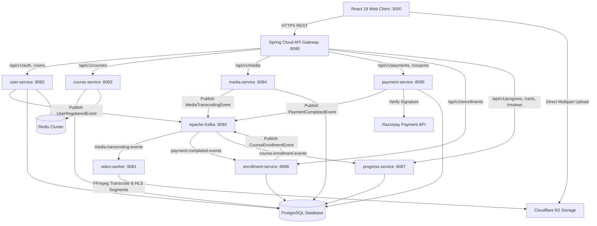
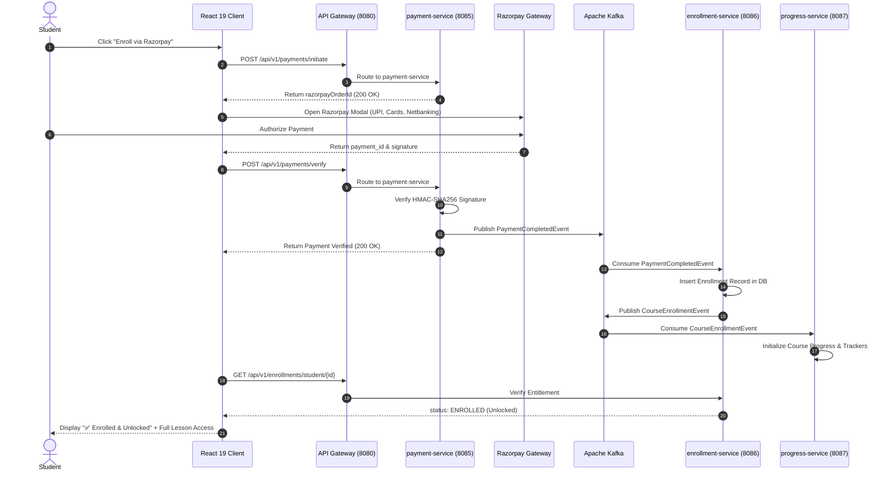
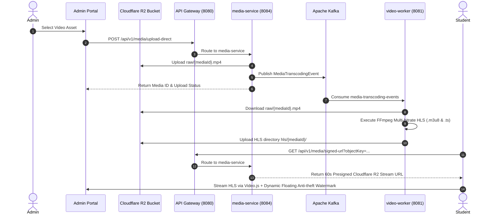

# Architectural Mermaid Diagrams

## 1. End-to-End Microservices Architecture

```mermaid
graph TD
    Client[React 19 Web Client :3000] -->|HTTPS REST| Gateway[Spring Cloud API Gateway :8080]
    Client -->|Direct Multipart Upload| R2[Cloudflare R2 Storage]
    
    Gateway -->|/api/v1/auth, /users| UserService[user-service :8082]
    Gateway -->|/api/v1/courses| CourseService[course-service :8083]
    Gateway -->|/api/v1/media| MediaService[media-service :8084]
    Gateway -->|/api/v1/payments, /coupons| PaymentService[payment-service :8085]
    Gateway -->|/api/v1/enrollments| EnrollmentService[enrollment-service :8086]
    Gateway -->|/api/v1/progress, /certs, /reviews| ProgressService[progress-service :8087]

    MediaService -->|Publish MediaTranscodingEvent| Kafka[Apache Kafka :9092]
    PaymentService -->|Publish PaymentCompletedEvent| Kafka
    EnrollmentService -->|Publish CourseEnrollmentEvent| Kafka
    UserService -->|Publish UserRegisteredEvent| Kafka

    Kafka -->|media-transcoding-events| Worker[video-worker :8081]
    Kafka -->|payment-completed-events| EnrollmentService
    Kafka -->|course-enrollment-events| ProgressService

    Worker -->|FFmpeg Transcode & HLS Segments| R2
    PaymentService -->|Verify Signature| Razorpay[Razorpay Payment API]

    UserService --> Postgres[(PostgreSQL Database)]
    CourseService --> Postgres
    MediaService --> Postgres
    PaymentService --> Postgres
    EnrollmentService --> Postgres
    ProgressService --> Postgres

    UserService --> Redis[(Redis Cluster)]
    CourseService --> Redis
```

## 2. Event-Driven Checkout & Auto-Enrollment Saga

```mermaid
sequenceDiagram
    autonumber
    actor Student
    participant React as React 19 Client
    participant GW as API Gateway (8080)
    participant PS as payment-service (8085)
    participant Rzp as Razorpay Gateway
    participant Kafka as Apache Kafka
    participant ES as enrollment-service (8086)
    participant PR as progress-service (8087)

    Student->>React: Click "Enroll via Razorpay"
    React->>GW: POST /api/v1/payments/initiate
    GW->>PS: Route to payment-service
    PS-->>React: Return razorpayOrderId (200 OK)
    React->>Rzp: Open Razorpay Modal (UPI, Cards, Netbanking)
    Student->>Rzp: Authorize Payment
    Rzp-->>React: Return payment_id & signature
    React->>GW: POST /api/v1/payments/verify
    GW->>PS: Route to payment-service
    PS->>PS: Verify HMAC-SHA256 Signature
    PS->>Kafka: Publish PaymentCompletedEvent
    PS-->>React: Return Payment Verified (200 OK)
    
    Kafka->>ES: Consume PaymentCompletedEvent
    ES->>ES: Insert Enrollment Record in DB
    ES->>Kafka: Publish CourseEnrollmentEvent

    Kafka->>PR: Consume CourseEnrollmentEvent
    PR->>PR: Initialize Course Progress & Trackers
    
    React->>GW: GET /api/v1/enrollments/student/{id}
    GW->>ES: Verify Entitlement
    ES-->>React: status: ENROLLED (Unlocked)
    React-->>Student: Display "✅ Enrolled & Unlocked" + Full Lesson Access
```

## 3. Video Transcoding & HLS Streaming Pipeline

```mermaid
sequenceDiagram
    autonumber
    actor Admin
    participant Frontend as Admin Portal
    participant R2 as Cloudflare R2 Bucket
    participant GW as API Gateway (8080)
    participant MS as media-service (8084)
    participant Kafka as Apache Kafka
    participant Worker as video-worker (8081)
    actor Student

    Admin->>Frontend: Select Video Asset
    Frontend->>GW: POST /api/v1/media/upload-direct
    GW->>MS: Route to media-service
    MS->>R2: Upload raw/{mediaId}.mp4
    MS->>Kafka: Publish MediaTranscodingEvent
    MS-->>Frontend: Return Media ID & Upload Status
    
    Kafka->>Worker: Consume media-transcoding-events
    Worker->>R2: Download raw/{mediaId}.mp4
    Worker->>Worker: Execute FFmpeg Multi-bitrate HLS (.m3u8 & .ts)
    Worker->>R2: Upload HLS directory hls/{mediaId}/
    
    Student->>GW: GET /api/v1/media/signed-url?objectKey=...
    GW->>MS: Route to media-service
    MS-->>Student: Return 60s Presigned Cloudflare R2 Stream URL
    Student->>Frontend: Stream HLS via Video.js + Dynamic Floating Anti-theft Watermark
```
